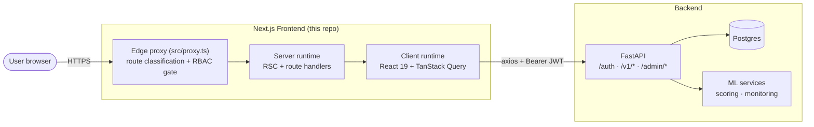
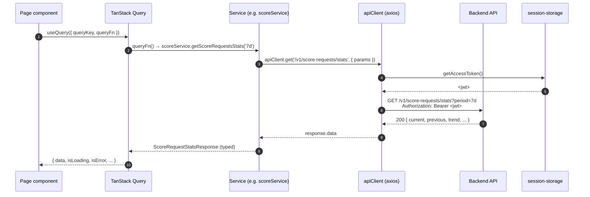
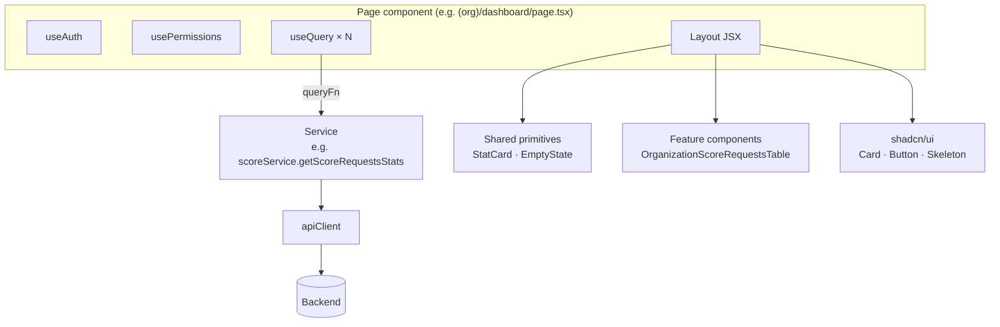

# Architecture

A tour of the frontend application: how requests flow, what lives where, and how the pieces fit together. For deeper coverage of specific subsystems, see the sibling docs:

- [Auth & RBAC](./auth-and-rbac.md) — login, 2FA, token refresh, permission gating.
- [Data flow](./data-flow.md) — service layer, TanStack Query, snake/camel mapping.
- [Feature map](./feature-map.md) — every page → endpoints consumed.
- [Security](./security.md) — threat model, hardening recommendations.

---

## 1. System context

The frontend is a Next.js (App Router) application that talks to a FastAPI backend over HTTPS. It serves two distinct portals from the same deployment, isolated by route group and middleware.



The browser and the backend never share a session cookie. The frontend stores its own AES-encrypted session cookie locally; the backend trusts only the signed JWT bearer token attached to each request. See [security.md](./security.md) for why this layering matters and what's still on the hardening backlog.

---

## 2. Tech stack at a glance

| Layer | Choice | Notes |
|---|---|---|
| Runtime | Node ≥ 20 | Required by Next 16 / React 19 |
| Framework | [Next.js 16](https://nextjs.org/docs) (App Router) | Edge middleware via `src/proxy.ts` |
| UI | React 19 + Tailwind CSS 4 + [shadcn/ui](https://ui.shadcn.com/) | Radix primitives under the hood |
| Server state | [TanStack Query 5](https://tanstack.com/query/latest) | Single `QueryClientProvider` at the root |
| Client state | React Context | Auth + theme only — no global store |
| Forms | [react-hook-form](https://react-hook-form.com/) + [zod](https://zod.dev/) | Schemas under `src/lib/schemas/` |
| HTTP | [axios](https://axios-http.com/) | Interceptors handle bearer-attach + 401 refresh |
| Toasts | [sonner](https://sonner.emilkowal.ski/) | Top-right, rich colors |
| Theme | [next-themes](https://github.com/pacocoursey/next-themes) | `light` / `dark` / `system` |
| Icons | [lucide-react](https://lucide.dev/) | |

There is no E2E or unit test suite checked in — see [known-issues.md](./known-issues.md).

---

## 3. Folder layout

```
src/
├── app/                          # Next.js App Router
│   ├── (auth)/                   # Route group: unauthenticated pages
│   │   ├── login/                # Org login
│   │   ├── admin-login/          # Admin login
│   │   ├── forgot-password/      # Password recovery: request reset
│   │   ├── reset-password/       # Password recovery: redeem token
│   │   └── layout.tsx            # Auth shell (logo, copy)
│   ├── (admin)/                  # Route group: platform-admin portal
│   │   ├── admin-dashboard/
│   │   ├── organizations/        # Org list + onboarding
│   │   ├── training/             # Training data + sources + uploads
│   │   ├── admin-score-requests/
│   │   ├── scoring-engine/
│   │   ├── admin-monitoring/     # Infra · risk · model-ops · compliance
│   │   ├── admin-access-control/ # Roles + permissions catalog
│   │   ├── admin-settings/
│   │   └── layout.tsx            # Admin sidebar + topbar
│   ├── (org)/                    # Route group: organization portal
│   │   ├── dashboard/
│   │   ├── score-requests/       # List + new + bulk + [id] detail
│   │   ├── developers/           # API keys, webhooks, logs
│   │   ├── teams/                # Org user CRUD
│   │   ├── reports/
│   │   ├── settings/
│   │   └── layout.tsx            # Org sidebar + topbar
│   ├── layout.tsx                # Root layout: providers, fonts, theme
│   └── not-found.tsx             # 404 / wrong-scope catch
├── components/
│   ├── ui/                       # shadcn primitives (button, dialog, ...)
│   ├── shared/                   # Cross-cutting (StatCard, EmptyState, RolePicker)
│   ├── auth/                     # LoginShell + 2FA + recovery
│   ├── score-requests/           # Tables, override modal, batch upload
│   ├── developers/               # API keys / webhooks / log views
│   ├── organization/             # Provisioning, suspend, profile
│   ├── teams/                    # Invite / edit user modals
│   ├── settings/                 # Personal-account / security tabs
│   ├── training/                 # Upload, source, status modals
│   ├── admin/                    # Admin-only tables & widgets
│   └── monitoring/               # Charts, alerts, drift cards
├── contexts/                     # AuthContext, ThemeContext
├── hooks/                        # usePermissions, useDebounce, ...
├── lib/
│   ├── api-client.ts             # axios instance + interceptors
│   ├── *-service.ts              # One file per backend domain
│   ├── auth-service.ts           # /auth/* — login, 2FA, password
│   ├── session-storage.ts        # AES-encrypted session cookie helpers
│   ├── schemas/                  # zod validation schemas
│   ├── constant.ts               # ROUTES, API_ENDPOINTS, PERMISSION_CODES
│   └── utils.ts                  # formatters, helpers
├── proxy.ts                      # Edge middleware — RBAC + zone enforcement
└── types/                        # Shared TS types (camelCase domain models)
```

---

## 4. Two portals, one deployment

The application serves two audiences from a single Next.js app:

| Portal | Audience | Route group | Login |
|---|---|---|---|
| **Organization** | Lender users (credit officers, devs, viewers) | `(org)` | `/login` |
| **Admin** | Platform operators (super admin, risk analyst, model ops, …) | `(admin)` | `/admin-login` |

Isolation is enforced at three layers:

1. **Edge middleware** ([`src/proxy.ts`](../src/proxy.ts)) decrypts the session cookie, classifies the requested path as `auth | admin | org | public`, and either lets it through, redirects to the right login, or rewrites to the not-found page if a user attempts a wrong-scope route.
2. **Backend authorization** is the hard boundary — every API call carries a JWT and the backend re-checks both `userType` and per-action permissions. The middleware is defense-in-depth, never the sole gate.
3. **Client-side `usePermissions()`** hides UI elements the user cannot use (buttons, menu items, columns), so a user with `score_requests.list` but not `score_requests.override` doesn't see the override action.

See [auth-and-rbac.md](./auth-and-rbac.md) for the full sequence diagrams.

---

## 5. Request lifecycle (data fetching)

A typical authenticated read follows this path:



If the backend returns **401**, the response interceptor (1) calls `POST /auth/refresh` with the stored refresh token, (2) updates the access token, and (3) retries the original request once. On refresh failure or any 401 from `/auth/*` endpoints, the interceptor clears the session and forces a redirect to `/login`. See [`src/lib/api-client.ts`](../src/lib/api-client.ts) for the implementation.

For mutations, the same path applies but the page component uses `useMutation` and is responsible for invalidating the relevant query keys after success.

---

## 6. Component composition pattern

A typical page is a thin orchestrator that wires together hooks, services, and presentational components:



Conventions:

- **Pages own data fetching.** They call `useQuery` / `useMutation` directly. There is no custom-hook indirection layer — query key factories (`SCORE_KEYS`, `MONITORING_KEYS`, …) keep keys consistent.
- **Services own typing and mapping.** Each `*-service.ts` exports a single object literal (e.g. `scoreService`) whose methods return camelCase domain types. Snake → camel mapping happens inside the service, never leaks to the caller.
- **Components are presentational where possible.** Tables and cards take props, not service calls. The dashboard page composes them.
- **Forms use react-hook-form + zod.** Schemas live in `src/lib/schemas/` and are reused between the form and any submission helper.

See [data-flow.md](./data-flow.md) for the service-layer convention in full.

---

## 7. Build & deploy targets

The app builds to a Next.js production bundle via `npm run build`. Routes split into two output kinds:

- **Static** (`○`) — pre-rendered at build time, served from CDN. Most authenticated routes still appear as static here because RSC defers data fetching to the client; the static shell renders a loading state.
- **Dynamic** (`ƒ`) — server-rendered per request (the `[id]` routes and the proxy middleware itself).

A deployment guide will be added in a separate document. The current build verifies clean on Node 20+ and produces a deploy-ready `.next/` directory plus the proxy middleware.

---

## 8. Where to start as a new contributor

Read in this order:

1. [auth-and-rbac.md](./auth-and-rbac.md) — understand who-can-do-what before reading any feature code.
2. [data-flow.md](./data-flow.md) — internalize the service convention so new endpoints look like the existing ones.
3. [feature-map.md](./feature-map.md) — find the page that handles the slice of the product you care about.
4. The relevant `*-service.ts` and the page that consumes it — these two files are usually enough to understand a feature end-to-end.

For backend changes that affect the FE, see [integrations.md](./integrations.md).
