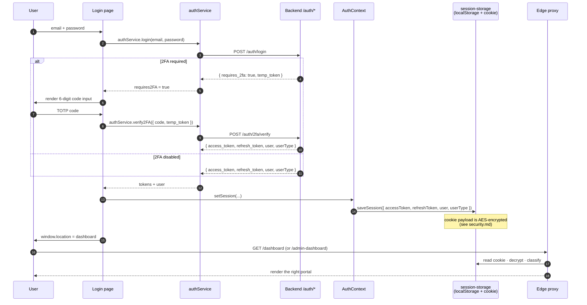
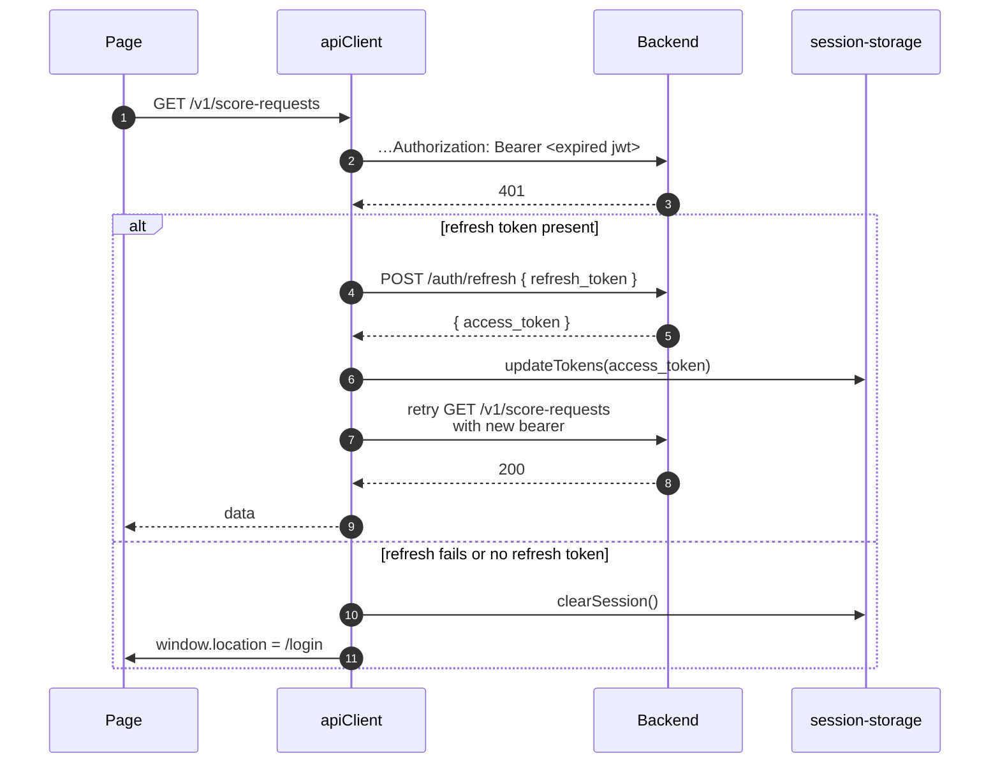
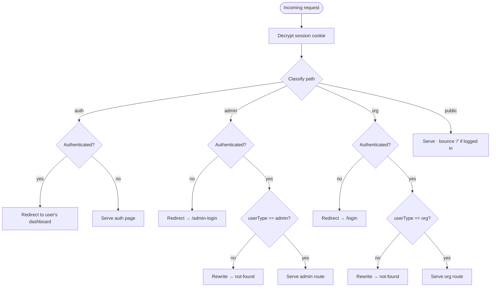
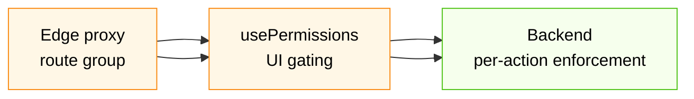

# Authentication & RBAC

How a user signs in, how their session is kept alive, and how the UI decides what they can see and do. The authoritative gate is always the backend — every diagram below shows the FE *cooperating* with backend authorization, not replacing it.

---

## 1. Audiences and entry points

Two distinct portals share one Next.js app:

| Portal | Login page | Route group | `userType` |
|---|---|---|---|
| Organization | `/login` | `(org)` | `org` |
| Admin | `/admin-login` | `(admin)` | `admin` |

Both portals use the same backend `/auth/login` endpoint; the response carries the `userType` claim that determines which portal the FE routes the user into. Both flows support an optional 2FA step.

Password recovery (`/forgot-password`, `/reset-password`) is shared.

---

## 2. End-to-end login sequence



Login page implementation: [`src/components/auth/login-shell.tsx`](../src/components/auth/login-shell.tsx).
Service: [`src/lib/auth-service.ts`](../src/lib/auth-service.ts).
Context: [`src/contexts/auth-context.tsx`](../src/contexts/auth-context.tsx).

---

## 3. Session, refresh, and inactivity

Once logged in, three mechanisms keep the session valid (or kill it):

### 3.1 Token refresh on 401

The axios response interceptor watches every API response. On a `401` from a non-`/auth/*` endpoint, it transparently refreshes the access token and retries the request once.



Implementation: [`src/lib/api-client.ts`](../src/lib/api-client.ts) lines 80–135.

A 401 from `/auth/*` itself is **not** treated as expiry — it's bad credentials and is bubbled up to the form.

### 3.2 Inactivity timeout

The auth context tracks user activity (`mousemove`, `keydown`, `click`, `scroll`, `touchstart`) and starts a timer. When the timer fires without activity, `logout()` is called — clearing the session and bouncing the user back to the right login page.

| Constant | Value | Defined in |
|---|---|---|
| `INACTIVITY_TIMEOUT_MS` | 10 minutes | [`src/lib/constant.ts`](../src/lib/constant.ts) |

### 3.3 Initial hydration

On mount, `AuthContext` calls `initializeAuth()`:

1. Read the cookie via `getSession()`.
2. If absent → `isLoading = false`, unauthenticated.
3. If present → hydrate state immediately from the cookie's `user` blob (instant UI).
4. In the background, call `GET /auth/me` and merge the up-to-date profile (especially `permissions[]`) into the cookie. If `/auth/me` fails, fall back to an empty permission array so `usePermissions().isLoading` doesn't hang forever.

This hydrate-then-refresh pattern is why the dashboard renders immediately after a hard refresh instead of flashing a loading spinner.

---

## 4. Route-level enforcement (edge proxy)

`src/proxy.ts` is a Next.js Edge middleware that runs on every navigation (excluding `_next/*`, API routes, and static assets). It is the **first** authorization gate — but never the only one.



Notable choices:

- **Wrong-scope access is rewritten to not-found, not redirected.** This keeps the URL in the address bar and avoids leaking the existence of admin paths to org users.
- **Headers** — every response gets `X-Frame-Options: DENY`, `Strict-Transport-Security`, `X-Content-Type-Options: nosniff`, `Referrer-Policy`, and a tight `Permissions-Policy`. See `SECURITY_HEADERS` in [`src/proxy.ts`](../src/proxy.ts).
- **The edge proxy never authorizes a real action** — it only decides which page to render. The backend re-checks the JWT and per-action permissions on every API call.

---

## 5. Permission gating in the UI

The `permissions[]` field on the user (resolved server-side, returned by `GET /auth/me`) is a flat list of dotted codes:

```ts
[
  "score_requests.list",
  "score_requests.create",
  "score_requests.read",
  "batch_scoring.list",
  "users.list",
  // ...
]
```

A super-admin's permission list is the single string `"*"`.

### 5.1 The hook

```ts
const { can, permissions, isLoading } = usePermissions();

if (can(PERMISSION_CODES.SCORE_REQUESTS.OVERRIDE)) {
  // render the override button
}
```

- `can(code)` — true if the user has the exact code, or holds `"*"`.
- `permissions` — the full set, for callers that need to test multiple codes at once.
- `isLoading` — true until `/auth/me` settles. Important for any render path that should not show "Forbidden" while permissions are still loading.

Implementation: [`src/hooks/use-permissions.ts`](../src/hooks/use-permissions.ts). Codes catalog: `PERMISSION_CODES` in [`src/lib/constant.ts`](../src/lib/constant.ts).

### 5.2 Where it's used

- **Conditional buttons** — "New score request", "Override", "Invite admin", "Revoke API key", etc.
- **Conditional menu items** in sidebars and dropdowns.
- **Page-level fallback** — pages that should be entirely unreachable for a permission-less user get a soft-deny message rather than a 404 (so the user knows the page exists but they can't view its data).
- **Query-enable** — some `useQuery` calls set `enabled: can(...)` so we don't even fire requests we know will 403.

### 5.3 Three layers, in order



The first two are conveniences — they hide the wrong UI and avoid pointless requests. The third is the real authority. Treat 403 responses from the backend as the ground truth; never assume `can()` is correct just because we render past it.

---

## 6. Two-factor authentication

Supported flows:

| Flow | Endpoint | UI |
|---|---|---|
| **Verify** during login | `POST /auth/2fa/verify` | `TwoFactorChallenge` in `login-shell.tsx` |
| **Setup** from settings | `POST /auth/2fa/setup` then `POST /auth/2fa/verify` | `TwoFactorSetupDialog` |
| **Remove** from settings | `POST /auth/2fa/remove` | `RemoveTwoFactorDialog` |

The setup dialog displays a QR code (rendered with `qrcode.react`) plus the secret string for manual entry. Verify accepts a 6-digit TOTP code. Remove requires both the password and a current TOTP code.

The personal-security cards on both portals (`(org)/settings` and `(admin)/admin-settings`) reuse the same three dialogs — see [`src/components/settings/`](../src/components/settings/).

---

## 7. Password recovery

| Page | Endpoint | Purpose |
|---|---|---|
| `/forgot-password` | `POST /auth/forgot-password` | Request an email with a reset link |
| `/reset-password` | `POST /auth/reset-password` | Redeem the reset token + set a new password |

Both pages are unauthenticated and live under `(auth)`.

---

## 8. Mock authentication (development only)

Setting `NEXT_PUBLIC_MOCK_AUTH=true` causes the login page to short-circuit the real backend and seed a fake session:

- `email` containing `admin` → admin portal session (`mock-admin` user)
- any other email → org portal session (`mock-user` in `Mock Organization`)
- `email` containing `2fa` → simulated 2FA challenge

`usePermissions()` returns `true` from `can()` for any mock user, so all UI is exercisable.

**This must be `false` in any deployed environment.** It is a developer convenience, not an auth fallback.

---

## 9. Summary of files to read

| File | What it owns |
|---|---|
| [`src/components/auth/login-shell.tsx`](../src/components/auth/login-shell.tsx) | Login form, 2FA challenge UI, mock-auth seeding |
| [`src/lib/auth-service.ts`](../src/lib/auth-service.ts) | All `/auth/*` calls + the `mergeUserFromMeProfile` helper |
| [`src/lib/api-client.ts`](../src/lib/api-client.ts) | Bearer attach, 401 refresh, error normalization |
| [`src/lib/session-storage.ts`](../src/lib/session-storage.ts) | Cookie/localStorage persistence + AES envelope |
| [`src/contexts/auth-context.tsx`](../src/contexts/auth-context.tsx) | React-side session state, hydration, inactivity timer |
| [`src/proxy.ts`](../src/proxy.ts) | Edge middleware: zone routing + security headers |
| [`src/hooks/use-permissions.ts`](../src/hooks/use-permissions.ts) | `can()` API |
| [`src/lib/constant.ts`](../src/lib/constant.ts) | `PERMISSION_CODES`, `ROUTES`, `INACTIVITY_TIMEOUT_MS` |
