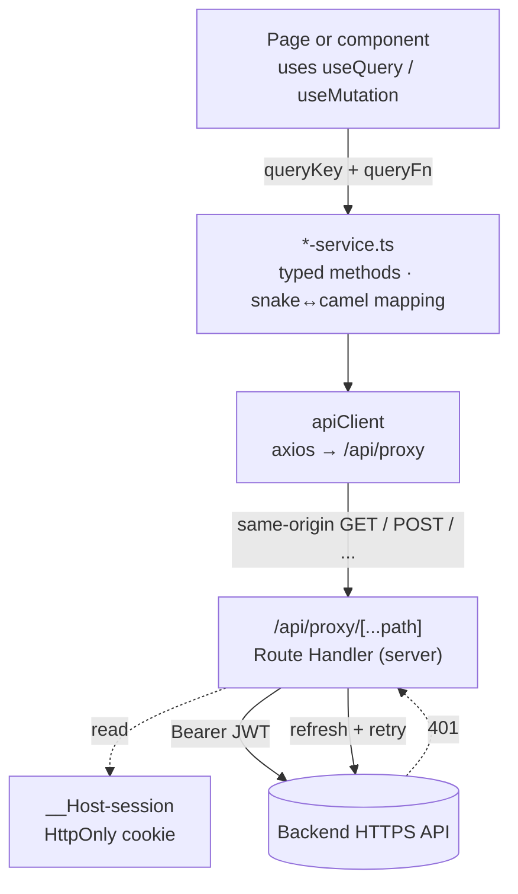

# Data flow

How the frontend talks to the backend, where types live, and the conventions every new endpoint should follow. If you're adding a feature that touches the API, this is the doc to read first.

---

## 1. Layers at a glance



Three rules keep this clean:

1. **Pages call services.** They never touch axios directly and never inline `fetch()`.
2. **Services own types and mapping.** Every method returns a camelCase domain type. Snake-case is contained to private types inside the service.
3. **The browser-side client is token-free.** The shared `apiClient` only points at same-origin `/api/proxy` and normalizes errors — bearer-attach and 401 refresh live server-side in the proxy Route Handler.

---

## 2. The shared API client

`src/lib/api-client.ts` exports a default axios instance configured with:

- `baseURL = "/api/proxy"` — same-origin Next Route Handler that forwards to the upstream `BACKEND_API_URL` server-side
- `timeout = 30000` ms
- `Content-Type: application/json` by default
- `withCredentials: true` so the HttpOnly session cookie travels with each request

The browser-side client is intentionally minimal: it carries **no** bearer-token logic and **no** refresh logic — those live in the proxy Route Handler at [`src/app/api/proxy/[...path]/route.ts`](../src/app/api/proxy/[...path]/route.ts) (see [auth-and-rbac.md §3.1](./auth-and-rbac.md#31-token-refresh-on-401)).

### Response interceptor

- **2xx** — pass through, log in dev.
- **401 (non-auth path)** — refresh already failed server-side; the interceptor redirects the browser to `/login`.
- **No response** (timeout / network error) — return a normalized `ApiError` with a user-friendly message.
- **FastAPI 422** — peel off the `detail[]` array and surface the first message, exposing the full validation list under `details.validationErrors`.
- **Anything else** — normalize into `ApiError { code, message, details, statusCode }` with sensible HTTP-status fallbacks.

Every service method gets a typed value back or a thrown `ApiError` — never a raw axios error.

---

## 3. Service layer convention

One file per backend domain under `src/lib/`. Each exports:

1. **Raw API types** (`Api*`, snake_case, private to the file).
2. **Public domain types** (camelCase) — exported for callers.
3. **Mapper functions** (`mapX`) that translate raw → domain.
4. **Query key factory** (`<DOMAIN>_KEYS`) — all keys for the domain in one place.
5. **The service object** with one async method per endpoint.

### Example: `score-service.ts`

```ts
// 1. Raw API shape (never leaks out of the file)
interface ApiRawScoreRequest {
  request_id: string;
  organization_id: string;
  status: string;
  score_value?: number | null;
  created_at: string;
  // ...
}

// 2. Public domain type — re-exports the model from src/types
export type ScoreRequestItem = ScoreRequest;

// 3. Mapper
function mapScoreRequest(raw: ApiRawScoreRequest): ScoreRequestItem {
  return {
    id: raw.request_id,
    organizationId: raw.organization_id,
    status: raw.status as ScoreRequestStatus,
    scoreValue: raw.score_value ?? null,
    createdAt: raw.created_at,
    // ...
  };
}

// 4. Query keys
export const SCORE_KEYS = {
  all: ["score-requests"] as const,
  lists: () => [...SCORE_KEYS.all, "list"] as const,
  list: (params: PaginationParams) => [...SCORE_KEYS.lists(), params] as const,
  details: () => [...SCORE_KEYS.all, "detail"] as const,
  detail: (id: string) => [...SCORE_KEYS.details(), id] as const,
  stats: (period: ScoreDashboardPeriod) =>
    [...SCORE_KEYS.all, "stats", period] as const,
};

// 5. Service
export const scoreService = {
  async getScoreRequests(params?: PaginationParams)
    : Promise<PaginatedResponse<ScoreRequestItem>> {
    const response = await apiClient.get<ApiPaginatedScoreRequests>(
      API_ENDPOINTS.SCORE_REQUESTS.BASE,
      { params: { /* snake_case query keys */ } },
    );
    return {
      items: response.data.items.map(mapScoreRequest),
      total: response.data.total,
      page: response.data.page,
      perPage: response.data.per_page,
      totalPages: response.data.total_pages,
    };
  },
  // ...
};
```

### Naming

| Concept | Convention |
|---|---|
| File | `<domain>-service.ts` (kebab-case) |
| Service object | `<domain>Service` (camelCase, e.g. `scoreService`) |
| Raw API type | `ApiRaw<Thing>` or `Api<Thing>` (snake_case fields) |
| Domain type | `<Thing>` (camelCase fields) — shared via `src/types/` when reused |
| Mapper | `map<Thing>(raw)` |
| Query keys factory | `<DOMAIN>_KEYS` (SCREAMING_SNAKE) |

### Catalog of services

| Service | File | Backend domain |
|---|---|---|
| `authService` | [`auth-service.ts`](../src/lib/auth-service.ts) | `/auth/*` — login, 2FA, password, profile |
| `scoreService` | [`score-service.ts`](../src/lib/score-service.ts) | `/v1/score-requests/*`, `/v1/score/batch/*`, `/v1/bureau-lookup` |
| `monitoringService` | [`monitoring-service.ts`](../src/lib/monitoring-service.ts) | `/v1/monitoring/*` |
| `organizationService` | [`organization-service.ts`](../src/lib/organization-service.ts) | `/admin/organizations/*`, `/org/profile` |
| `userManagementService` | [`user-management-service.ts`](../src/lib/user-management-service.ts) | `/org/users/*` |
| `adminManagementService` | [`admin-management-service.ts`](../src/lib/admin-management-service.ts) | `/admin/admins/*` |
| `trainingService` | [`training-service.ts`](../src/lib/training-service.ts) | `/admin/training-data/*`, `/admin/sources/*` |
| `rbacService` | [`rbac-service.ts`](../src/lib/rbac-service.ts) | `/v1/permissions`, `/v1/roles/*` |

Endpoint constants live in `API_ENDPOINTS` ([`src/lib/constant.ts`](../src/lib/constant.ts)).

---

## 4. TanStack Query setup

A single `QueryClient` is created in [`src/lib/query-client.tsx`](../src/lib/query-client.tsx) and provided at the root layout:

```ts
queries: {
  staleTime: 5 * 60 * 1000,       // 5 min
  gcTime: 10 * 60 * 1000,         // 10 min
  retry: (n, err) => {
    // 4xx → no retry; otherwise up to 3 attempts
    if (err?.statusCode >= 400 && err.statusCode < 500) return false;
    return n < 3;
  },
  refetchOnWindowFocus: false,    // opt-in per query when needed
},
mutations: { retry: false },
```

These are defaults — individual `useQuery` calls override them when polling cadence demands it. The dashboard, for example, sets `refetchInterval: 60_000` for the `today` period and `5 * 60_000` otherwise.

### Query keys

There are two coexisting patterns:

1. **Per-service factories** — `SCORE_KEYS`, `BATCH_KEYS`, `MONITORING_KEYS`, `RBAC_KEYS`, etc., colocated with the service. **Prefer this pattern for new code.**
2. **The legacy `queryKeys` object** in `query-client.tsx` — kept for callers that haven't been migrated yet. New features should not extend it.

### Invalidation

Mutations follow this pattern:

```ts
const mutation = useMutation({
  mutationFn: (payload) => orgService.suspendOrganization(id),
  onSuccess: () => {
    queryClient.invalidateQueries({ queryKey: ORG_KEYS.list() });
    queryClient.invalidateQueries({ queryKey: ORG_KEYS.detail(id) });
    toast.success("Organization suspended");
  },
});
```

A handful of mutations also call `queryClient.setQueryData()` for optimistic updates — search for `setQueryData` in the repo to see examples.

---

## 5. Pagination convention

Lists across the API share the same wire shape:

```json
{ "items": [...], "total": 184, "page": 1, "per_page": 20, "total_pages": 10 }
```

The shared TS contract lives in [`src/types/api-type.ts`](../src/types/api-type.ts):

```ts
export interface PaginatedResponse<T> {
  items: T[];
  total: number;
  page: number;
  perPage: number;
  totalPages: number;
}

export interface PaginationParams {
  page?: number;
  perPage?: number;
  search?: string;
  status?: string;
  risk?: string;
  decision?: string | string[];   // arrays are comma-joined on the wire
}
```

A list endpoint gets a method shaped like:

```ts
async getThings(params?: PaginationParams): Promise<PaginatedResponse<Thing>> {
  const response = await apiClient.get<ApiPaginatedThings>(API_ENDPOINTS.THINGS.BASE, {
    params: {
      page: params?.page,
      per_page: params?.perPage || TABLE_ITEM_PER_PAGE,
      // domain-specific filters …
    },
  });
  return {
    items: response.data.items.map(mapThing),
    total: response.data.total,
    page: response.data.page,
    perPage: response.data.per_page,
    totalPages: response.data.total_pages,
  };
}
```

`TABLE_ITEM_PER_PAGE` (10) is the default page size for table views.

---

## 6. Form pattern

Forms use react-hook-form with zod resolvers. Schemas live in [`src/lib/schemas/`](../src/lib/schemas/) so they can be shared between the form, any draft state, and tests.

```ts
// src/lib/schemas/team-management.ts
export const inviteUserSchema = z.object({
  email: z.string().email(),
  fullName: z.string().min(1),
  roleId: z.string().min(1),
});
export type InviteUserPayload = z.infer<typeof inviteUserSchema>;

// In the modal component:
const form = useForm<InviteUserPayload>({
  resolver: zodResolver(inviteUserSchema),
  defaultValues: { email: "", fullName: "", roleId: "" },
});

const submit = form.handleSubmit(async (values) => {
  await mutation.mutateAsync(values);
});
```

Schemas in `src/lib/schemas/`:

- `admin-management.ts` — invite/edit admin
- `batch-scoring.ts` — bulk upload payload
- `developer-training-management.ts` — training upload
- `organization-management.ts` — org profile + provisioning
- `settings-management.ts` — change password, 2FA, personal account
- `team-management.ts` — invite/edit org user

---

## 7. Adding a new endpoint — checklist

Walk through this when wiring a new endpoint.

1. **Add the endpoint constant** in `API_ENDPOINTS` (`src/lib/constant.ts`).
2. **Define the raw API type** (`Api*`) inside the relevant `*-service.ts`.
3. **Define / export the domain type** (camelCase). Reuse types from `src/types/` if applicable.
4. **Write the mapper** (`mapX`) — only if snake/camel translation is needed.
5. **Add the query-key entry** to the service's `_KEYS` factory.
6. **Add the service method** — receive typed params, return the typed response.
7. **Consume from the page** with `useQuery` / `useMutation`, using the new key.
8. **Invalidate** on related mutations.
9. **Run** `npx tsc --noEmit` to confirm types align end-to-end.

Don't skip the mapper layer even when fields look identical — the API has changed shape under us before, and centralizing the mapping has prevented widespread regressions every time.

---

## 8. Where to look when something breaks

| Symptom | Likely culprit |
|---|---|
| 401 loop / repeated redirects to `/login` | Server-side refresh in `app/api/proxy/[...path]/route.ts` failing — refresh token expired or backend rejected refresh |
| Numbers off / wrong on a dashboard | Stats endpoint period mismatch, or stale query key |
| "Validation error" with no specifics | FastAPI 422 — open the network tab, check `details.validationErrors[0]` |
| Mutation succeeded but list didn't update | Missing `invalidateQueries` in `onSuccess` |
| Type error on a mapped field | Raw API shape changed; update `Api*` and the mapper |
| 403 on a page that should work | User missing the permission code; check `PERMISSION_CODES` and `usePermissions().permissions` |

For permission-related issues, [auth-and-rbac.md](./auth-and-rbac.md) covers the full RBAC story.
