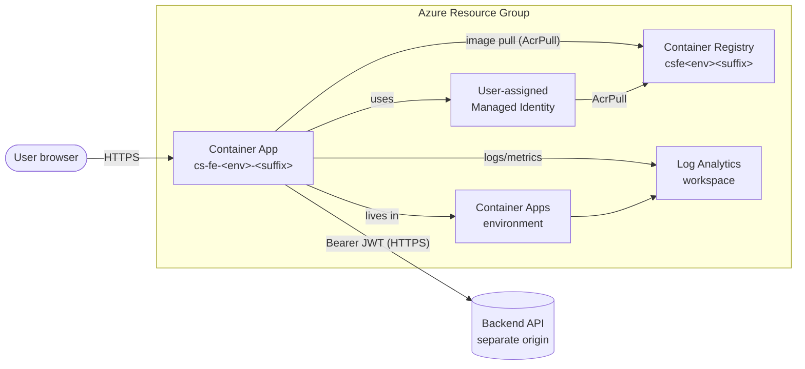

# Deployment guide

How to deploy the PaySwitch Credit Scoring frontend to **Azure Container Apps** using the Bicep stack and helper scripts that ship in this repository.

This guide is the canonical reference for the client engineering team. It assumes only:

- An Azure subscription you can deploy into.
- A working install of [Azure CLI](https://learn.microsoft.com/en-us/cli/azure/install-azure-cli) (≥ 2.55).
- Either Docker Desktop locally, **or** willingness to use [ACR Build](https://learn.microsoft.com/en-us/azure/container-registry/container-registry-quickstart-task-cli) so you don't need a local Docker daemon.
- The backend API is already deployed at a known URL (the FE talks to it as a separate origin).

It does **not** assume anything about the FE codebase that isn't already documented in [architecture.md](./architecture.md) or [security.md](./security.md).

---

## 1. What gets deployed



| Resource | Bicep name pattern | Purpose |
|---|---|---|
| Log Analytics workspace | `cs-fe-<env>-<suffix>-logs` | Receives container logs / metrics |
| Container Registry | `csfe<env><suffix>` | Holds the FE image; private |
| User-assigned Managed Identity | `cs-fe-<env>-<suffix>-id` | Image-pull identity (AcrPull role) |
| Container Apps Environment | `cs-fe-<env>-<suffix>-env` | Shared host for revisions |
| Container App | `cs-fe-<env>-<suffix>` | The Next.js workload (port 3000) |

`<env>` is `dev`, `stg`, or `prod`. `<suffix>` is a 3–8 char alphanumeric stem you pick once per resource group (it makes globally-unique resources like ACR / Log Analytics safe).

Source files:

- [`Dockerfile`](../Dockerfile) — multi-stage standalone Next.js image.
- [`deploy/azure/main.bicep`](../deploy/azure/main.bicep) — the full stack.
- [`deploy/azure/parameters.dev.json`](../deploy/azure/parameters.dev.json), [`parameters.prod.json`](../deploy/azure/parameters.prod.json) — environment-specific values.
- [`deploy/scripts/deploy.sh`](../deploy/scripts/deploy.sh) — one-shot build + push + deploy.
- [`deploy/scripts/set-secrets.sh`](../deploy/scripts/set-secrets.sh) — rotate runtime secrets.
- [`.github/workflows/deploy.yml`](../.github/workflows/deploy.yml) — GitHub Actions CD.
- [`azure-pipelines.yml`](../azure-pipelines.yml) — Azure DevOps CD (alternative to GHA).

---

## 2. First-time setup

You only do this once per resource group / environment.

### 2.1 Pick a `<suffix>`

Anything 3–8 alphanumeric characters that's globally unique to this stack works. A common pattern is the resource group's short name plus a few random chars (`prod42`, `cs7w9p`, …). Once chosen, **never change it** — the suffix appears in every resource name.

### 2.2 Generate the session secret

```bash
openssl rand -hex 64
```

Save the output. You'll paste it into the parameters file in §2.4 (and into your CI environment secret if you wire CI/CD).

> The secret is read **server-side only** by the Next Route Handlers under `src/app/api/auth/*` to seal the HttpOnly session cookie. It never reaches the browser. Use a different value per environment and rotate when staff leave. See [security.md §3](./security.md#3-token-storage).

### 2.3 Create the resource group

```bash
az login
az account set --subscription <subscription-id>

az group create \
  --name cs-fe-prod-rg \
  --location westeurope
```

Pick the location closest to your users and to the backend.

### 2.4 Fill in the parameters file

Copy the template for your environment and fill in the placeholders:

```bash
cp deploy/azure/parameters.prod.json deploy/azure/parameters.prod.local.json
$EDITOR deploy/azure/parameters.prod.local.json
```

| Field | What to put in it |
|---|---|
| `resourceSuffix` | The 3–8 char stem from §2.1 |
| `containerImage` | Initial value can be `<acr>.azurecr.io/credit-scoring-fe:1.0.0`. The deploy script overrides this on every run. |
| `backendApiUrl` | The backend's public HTTPS URL, no trailing slash. Server-only — never reaches the browser. |
| `minReplicas` / `maxReplicas` | Reasonable defaults: `1`/`3` for dev, `2`/`10` for prod |

Keep the `*.local.json` copy out of source control (`.gitignore` already covers `*.local.json` patterns under env files; verify before committing).

---

## 3. One-shot deploy from your laptop

```bash
deploy/scripts/deploy.sh \
  --resource-group cs-fe-prod-rg \
  --location westeurope \
  --environment prod \
  --suffix prod42 \
  --tag 1.0.0 \
  --parameters deploy/azure/parameters.prod.local.json
```

What it does, in order:

1. Creates the resource group if missing.
2. Creates the ACR named `csfeprod<suffix>` if missing.
3. Builds `Dockerfile` (no build args needed — every secret is read at runtime) and pushes the resulting image to ACR.
4. Runs `az deployment group create` against [`main.bicep`](../deploy/azure/main.bicep) with the parameters file + the just-pushed image.
5. Prints the public FQDN of the new revision.

Common flags:

- `--use-acr-build` — build inside Azure (no local Docker required). Slightly slower but lets you deploy from any machine.
- `--parameters <path>` — point at a different parameters file (e.g. when running from a CI runner that has the secrets injected).

You should see something like:

```
✓ Container App: https://cs-fe-prod-prod42.westeurope.azurecontainerapps.io
✓ Container App name: cs-fe-prod-prod42
```

---

## 4. Configuration is runtime-only — the image is environment-portable

Tokens never reach the browser, and the FE has no `NEXT_PUBLIC_*` configuration. As a result:

- The container image is **the same** for dev, staging, and prod. Promotion is a tag move.
- The only runtime configuration is `BACKEND_API_URL`, surfaced as a Container App secret.
- Rotating the backend URL is a Container App secret update — no rebuild needed:

```bash
deploy/scripts/set-secrets.sh \
  --resource-group cs-fe-prod-rg \
  --app cs-fe-prod-prod42 \
  --backend-api-url https://api.payswitch.example.com
```

To redeploy with a new image tag:

```bash
deploy/scripts/deploy.sh \
  --resource-group cs-fe-prod-rg \
  --location westeurope \
  --environment prod \
  --suffix prod42 \
  --tag 1.0.1 \
  --parameters deploy/azure/parameters.prod.local.json
```

Container Apps shifts traffic to the new revision once it passes its readiness probe.

---

## 5. CI/CD

The repo ships **two** continuous-deployment workflows. Pick **one** as your source of truth and delete (or simply not configure) the other.

### Option A — GitHub Actions

Files: [`.github/workflows/ci.yml`](../.github/workflows/ci.yml), [`.github/workflows/deploy.yml`](../.github/workflows/deploy.yml).

- `ci.yml` runs typecheck, lint, unit tests, and (on PRs to `main`/`develop`) Playwright E2E.
- `deploy.yml`:
  - Push to `develop` → deploys to **dev**.
  - Push of a `v*` tag → deploys to **prod**.
  - Manual `workflow_dispatch` → choose env.

Auth uses **OIDC federated credentials** so you never store an Azure client secret in GitHub. Setup:

```bash
# 1. Create the AAD app registration (or reuse an existing one)
APP_ID=$(az ad app create --display-name cs-fe-github --query appId -o tsv)
SP_ID=$(az ad sp create --id $APP_ID --query id -o tsv)

# 2. Grant Contributor on the resource group
az role assignment create \
  --assignee $APP_ID \
  --role Contributor \
  --scope /subscriptions/<sub-id>/resourceGroups/cs-fe-prod-rg

# 3. Add a federated credential per branch / tag pattern
az ad app federated-credential create --id $APP_ID --parameters '{
  "name": "github-cs-fe-tag-prod",
  "issuer": "https://token.actions.githubusercontent.com",
  "subject": "repo:<org>/<repo>:ref:refs/tags/v*",
  "audiences": ["api://AzureADTokenExchange"]
}'
```

Then in **GitHub → Settings → Environments**, create `dev` and `prod` environments and add:

| Scope | Type | Name | Value |
|---|---|---|---|
| Repo secrets | secret | `AZURE_CLIENT_ID` | `$APP_ID` |
| Repo secrets | secret | `AZURE_TENANT_ID` | (your tenant) |
| Repo secrets | secret | `AZURE_SUBSCRIPTION_ID` | (your sub) |
| Repo secrets | secret | `AZURE_RESOURCE_GROUP` | `cs-fe-prod-rg` |
| Repo secrets | secret | `AZURE_RESOURCE_SUFFIX` | `prod42` |
| Env (`prod`) secret | secret | `BACKEND_API_URL` | `https://api.payswitch.example.com` |
| Env (`dev`) secret | secret | `BACKEND_API_URL` | `https://api-dev.…` |

For `prod` consider enabling **required reviewers** in the environment settings — the workflow will pause for approval before deploying.

### Option B — Azure DevOps Pipelines

File: [`azure-pipelines.yml`](../azure-pipelines.yml). The same three stages (validate → build → deploy) using ADO native primitives.

Setup:

1. Create an **Azure Resource Manager** service connection — workload identity is strongly preferred over secret-based auth.
   ```yaml
   variables:
     azureServiceConnection: cs-fe-azure
   ```
   Update the variable name in the pipeline if you call your connection something else.
2. Create two variable groups in **Library**:
   - `cs-fe-shared` — `AZURE_RESOURCE_GROUP`, `AZURE_RESOURCE_SUFFIX`.
   - `cs-fe-dev` and `cs-fe-prod` — `BACKEND_API_URL` (mark as 🔒).
3. Create matching ADO **Environments** named `dev` and `prod`. Attach approval gates to `prod`.

Triggers (same semantics as GitHub):
- Push to `develop` → dev.
- Push of `v*` tag → prod.
- Manual run with the `targetEnvironment` parameter.

---

## 6. Custom domain + TLS (client-managed)

Client owns the DNS record and certificate. Two-step process:

### 6.1 Bind the hostname to the Container App

```bash
APP=cs-fe-prod-prod42
RG=cs-fe-prod-rg
HOST=app.payswitch.example.com

# 1. Get the verification info
az containerapp hostname add \
  --hostname $HOST \
  --name $APP \
  --resource-group $RG
```

This returns a `validationToken`. Add **two** DNS records at your DNS provider:

| Type | Name | Value |
|---|---|---|
| `CNAME` | `app` | `<app-fqdn>.azurecontainerapps.io` |
| `TXT` | `asuid.app` | `<validationToken>` |

Wait for propagation (`dig` or [dnschecker.org](https://dnschecker.org)).

### 6.2 Bind a managed certificate

```bash
az containerapp hostname bind \
  --hostname $HOST \
  --name $APP \
  --resource-group $RG \
  --environment cs-fe-prod-prod42-env \
  --validation-method CNAME
```

Azure issues a free managed certificate (renews automatically). For a customer-supplied cert, use `--validation-method TXT` and upload the cert with `az containerapp env certificate upload` first.

### 6.3 Make it the canonical origin

The browser only ever calls `/api/*` on this Next app. The Next Route Handlers proxy server-side to the backend at `BACKEND_API_URL`. Moving the FE to a custom domain therefore requires no FE rebuild and no backend CORS configuration — same-origin everywhere.

> **CORS is no longer a deployment concern.** The browser doesn't talk to the backend directly, so the backend doesn't need the FE's origin in any allow-list.

---

## 7. Post-deploy verification

After every deploy, run through this checklist:

```bash
APP=cs-fe-prod-prod42
RG=cs-fe-prod-rg
FQDN=$(az containerapp show -n $APP -g $RG \
  --query 'properties.configuration.ingress.fqdn' -o tsv)

# 1. Smoke test — should be 200 (or 307 redirect to /login)
curl -fsSI https://$FQDN | head -5

# 2. Security headers — should include X-Frame-Options, HSTS, etc.
curl -fsSI https://$FQDN | grep -iE 'x-frame|hsts|strict-transport|content-type-options|referrer-policy'

# 3. Latest revision is healthy
az containerapp revision list -n $APP -g $RG \
  --query '[].{name:name, active:properties.active, healthy:properties.healthState, replicas:properties.replicas}' \
  --output table

# 4. Tail logs for the last few minutes
az containerapp logs show -n $APP -g $RG --tail 100
```

Then in a browser:

1. Open `https://$FQDN` — you should land on `/login` (the proxy redirects unauthenticated requests).
2. Sign in with a real backend account.
3. Open DevTools → Network → confirm the login POST goes to **same-origin** `/api/auth/login` (the Next Route Handler), not directly to the backend. The HttpOnly `__Host-session` cookie should appear under Application → Cookies.
4. Hit a wrong-scope path (e.g. `/admin-dashboard` as an org user) — confirm it renders the not-found page **without changing the URL** (proxy rewrite, see [auth-and-rbac.md §4](./auth-and-rbac.md#4-route-level-enforcement-edge-proxy)).

---

## 8. Rollback

Container Apps keeps recent revisions warm. To roll back:

```bash
APP=cs-fe-prod-prod42
RG=cs-fe-prod-rg

# List revisions, newest first
az containerapp revision list -n $APP -g $RG \
  --query '[].{name:name, active:properties.active, created:properties.createdTime}' \
  --output table

# Activate the previous good one
az containerapp revision activate \
  --revision <previous-revision-name> \
  --name $APP \
  --resource-group $RG

# Send 100% of traffic to it
az containerapp ingress traffic set \
  --name $APP \
  --resource-group $RG \
  --revision-weight <previous-revision-name>=100
```

Or simply re-run `deploy.sh` with the previous Git tag.

---

## 9. Operations

### Logs

```bash
az containerapp logs show -n $APP -g $RG --tail 200       # recent
az containerapp logs show -n $APP -g $RG --follow         # live stream
```

For longer-window queries use Log Analytics directly:

```bash
WS=$(az monitor log-analytics workspace show \
  -g $RG -n cs-fe-prod-prod42-logs --query customerId -o tsv)

az monitor log-analytics query --workspace $WS \
  --analytics-query "ContainerAppConsoleLogs_CL | where ContainerName_s == 'frontend' | take 100"
```

### Scaling

Edit `minReplicas` / `maxReplicas` in the parameters file and re-run `deploy.sh`. Or change at runtime:

```bash
az containerapp update \
  --name $APP --resource-group $RG \
  --min-replicas 2 --max-replicas 20
```

### Cost ceiling

The Bicep stack uses Basic-tier ACR and PerGB2018 Log Analytics. Set a daily quota on the workspace if you're cost-conscious; the template already caps at 1 GB/day.

---

## 10. Tearing it all down

```bash
az group delete --name cs-fe-prod-rg --yes --no-wait
```

This removes everything in §1, including the registry. Anything outside the resource group (DNS records, the AAD app for OIDC, …) is untouched.

---

## 11. Troubleshooting

| Symptom | Likely cause | Fix |
|---|---|---|
| `ImagePullBackOff` on the Container App | Managed identity hasn't received AcrPull yet | Wait 30 s — the role-assignment is async; or `az role assignment create` manually. |
| Browser shows `Unable to connect` after a clean deploy | `BACKEND_API_URL` unreachable from the Container App | Verify the URL with `curl` from a sidecar / `az containerapp exec`; the browser never talks to the backend directly so this is always a server-side reachability issue. |
| Login form submits but stalls | `BACKEND_API_URL` Container App secret is wrong / unset | `deploy/scripts/set-secrets.sh --backend-api-url …` then verify with `az containerapp logs show`. |
| `tsc --noEmit` clean locally, fails in CI | Node version mismatch (CI is 20, local was 22) | Pin the Node engine in `package.json` and align CI to match. |
| Revision flips to "Failed" with no obvious error | Liveness probe times out (cold start > 10 s) | Bump probe `initialDelaySeconds` in `main.bicep` or set `minReplicas: 1` to keep one warm. |
| `Persisting failed: Unable to write SST file` in dev | Two Next.js processes writing to the same `.next/` (dev + Playwright build colliding) | Use a separate `distDir` for Playwright (the E2E config already does this via `.next-e2e`). |

---

## 12. What's NOT in this guide

- **The backend API**: separate repository, separate deploy. The frontend's only relationship is the server-side `BACKEND_API_URL`. No CORS coordination is required because the browser never talks to the backend directly.
- **Customer SSL termination**: the `azurecontainerapps.io` domain comes with a wildcard cert; for customer domains, see §6.
- **Application Insights**: not provisioned. The Container App writes logs and metrics to Log Analytics; if richer APM is required later, attach Application Insights to the same workspace.
- **Backend hardening**: backend-owned concerns (rate-limiting, JWT signing-key rotation, audit logs) are out of scope for this guide.
