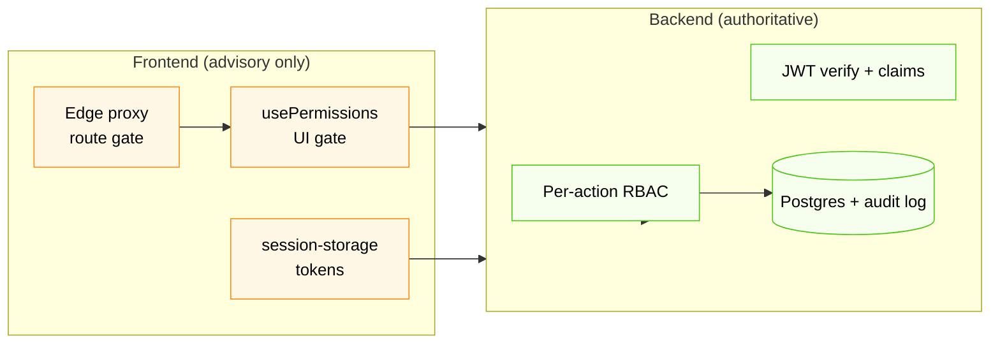

# Security

The frontend's security posture and the threat model it's designed against. The hard authority on every privileged action is the backend — the FE's job is to fail safely, not to act as a primary authorization boundary.

For runtime auth & RBAC mechanics, see [auth-and-rbac.md](./auth-and-rbac.md).

---

## 1. Threat model

The application targets:

| Threat | Mitigation in place |
|---|---|
| **Cross-site scripting (XSS)** | React escapes all rendered values by default. We never use `dangerouslySetInnerHTML`. CSP forbids the page being framed (`frame-ancestors 'none'`). No third-party scripts beyond what `next/script` includes. |
| **Clickjacking** | `X-Frame-Options: DENY` + `Content-Security-Policy: frame-ancestors 'none'` (set in both [`next.config.ts`](../next.config.ts) and [`src/proxy.ts`](../src/proxy.ts)). |
| **MIME sniffing** | `X-Content-Type-Options: nosniff`. |
| **Mixed content / downgrade attacks** | `Strict-Transport-Security: max-age=63072000; includeSubDomains; preload`. |
| **Referrer leakage** | `Referrer-Policy: strict-origin-when-cross-origin`. |
| **Powerful-API abuse** | `Permissions-Policy` denies camera, mic, geolocation, payment, usb, FLoC. |
| **Wrong-scope navigation** | Edge proxy classifies routes; admin paths rewrite to not-found for org users (no path leak). |
| **Token theft via XSS** | Tokens live in an `HttpOnly` `__Host-` cookie set server-side; JavaScript cannot read them. See §3. |
| **CSRF on state-changing API calls** | API uses `Authorization: Bearer <jwt>` headers, not cookies, so the classical CSRF vector doesn't apply. |
| **Brute-force login / 2FA bypass** | Enforced by the backend (rate limits, lockouts, TOTP). FE simply renders the response. |
| **Inactivity → account hijack** | 10-minute idle timer auto-logs the user out (see [auth-and-rbac.md §3.2](./auth-and-rbac.md#32-inactivity-timeout)). |

Out of scope for the FE: account takeover via password reset, DDoS, key compromise on the backend, infra hardening. Those belong to the backend / ops team.

---

## 2. Where authority lives

A 403 from the backend is the ground truth. The FE may *also* hide the same action because `usePermissions().can(...)` returns false, but that's UX — it must never be relied upon as a security boundary.

---

## 3. Token storage

Tokens live in a single **`HttpOnly`, `Secure`, `__Host-` prefixed cookie** set by Next Route Handlers under [`src/app/api/auth/*`](../src/app/api/auth/). They never reach JavaScript on the client. Concretely:

| What | Where | Visible to JS? |
|---|---|---|
| Access token | `__Host-session` cookie payload | ❌ |
| Refresh token | `__Host-session` cookie payload | ❌ |
| User profile + `userType` | Same cookie + a non-sensitive `localStorage` cache for instant re-hydration | User profile yes (no tokens) |

### Request lifecycle

1. Browser → `POST /api/auth/login` (Next Route Handler).
2. Route handler → backend `/auth/login`. Captures `access_token` + `refresh_token` server-side.
3. Route handler sets the `__Host-session` cookie with `HttpOnly; Secure; SameSite=Strict; Path=/`.
4. Response to the browser contains only `{ user, userType }` — no tokens.
5. Subsequent backend calls go via `/api/proxy/[...path]`. The proxy reads the cookie server-side, attaches `Authorization: Bearer <accessToken>`, forwards to the backend, and returns the response. On 401 it refreshes once + retries.

Source files:

- [`src/lib/server-session.ts`](../src/lib/server-session.ts) — cookie helpers (server-only).
- [`src/app/api/auth/login/route.ts`](../src/app/api/auth/login/route.ts), [`/2fa/verify`](../src/app/api/auth/2fa/verify/route.ts), [`/refresh`](../src/app/api/auth/refresh/route.ts), [`/logout`](../src/app/api/auth/logout/route.ts), [`/me`](../src/app/api/auth/me/route.ts).
- [`src/app/api/proxy/[...path]/route.ts`](../src/app/api/proxy/[...path]/route.ts) — catch-all backend proxy.

### What this protects against

- **XSS exfiltration** — JavaScript cannot read the cookie. Even a successful XSS can issue requests as the user (via the same-origin cookie) but cannot lift the bearer token off the page.
- **Cookie-snooping at rest** — the cookie is opaque on disk; the backend signs the JWT inside, the FE never decodes it.
- **CSRF** — `SameSite=Strict` blocks cross-site requests from carrying the cookie. Combined with the same-origin-only proxy, classical CSRF is structurally impossible.

### What still needs care

- An XSS payload can still **make requests as the user** because the browser will include the cookie automatically. The cookie isolates the secret material, not the user's authority. Continue to keep XSS out (input handling, no `dangerouslySetInnerHTML`, CSP).
- The cookie is `__Host-`-scoped, so it only travels to the FE origin. The proxy attaches the bearer to the upstream backend server-side, so the backend never sees the cookie at all.

---

## 4. Security headers (defense in depth)

Two layers ensure every response carries the same headers — if the proxy matcher ever lets a path through unprocessed, the framework-level headers in `next.config.ts` still apply.

| Header | Value | Set by |
|---|---|---|
| `Strict-Transport-Security` | `max-age=63072000; includeSubDomains; preload` | next.config + proxy |
| `X-Frame-Options` | `DENY` | next.config + proxy |
| `Content-Security-Policy` | `frame-ancestors 'none'` | next.config |
| `X-Content-Type-Options` | `nosniff` | next.config + proxy |
| `Referrer-Policy` | `strict-origin-when-cross-origin` | next.config + proxy |
| `Permissions-Policy` | `camera=(), microphone=(), geolocation=(), payment=(), usb=(), interest-cohort=()` | next.config + proxy |
| `X-DNS-Prefetch-Control` | `off` | next.config |

The CSP currently ships `frame-ancestors 'none'` only. A nonce-based `script-src` policy was evaluated but would require `'unsafe-inline'` / `'unsafe-eval'` to make Next.js's runtime work, which negates most of its value; the other high-value headers (HSTS, X-Frame-Options, X-Content-Type-Options, Referrer-Policy, Permissions-Policy) provide the bulk of the protection. See `next.config.ts` for the comment explaining this trade-off.

---

## 5. Secrets & environment variables

| Variable | Sensitivity | Notes |
|---|---|---|
| `BACKEND_API_URL` | Server-only | Read by Next Route Handlers; never reaches the browser. |

All FE configuration is server-only — no `NEXT_PUBLIC_*` variables. The image is therefore environment-portable: the same tag promotes from dev → prod with only a runtime env-var change. For Kubernetes deployments, `BACKEND_API_URL` should be injected via Kubernetes Secret synced from Azure Key Vault (External Secrets), not committed into manifests or baked into images. The backend remains the keeper of all upstream secrets (DB credentials, ML model keys, JWT signing keys).

---

## 6. Logging & telemetry

- **Request/response logging** is on only when `NODE_ENV === "development"` (see [`src/lib/api-client.ts`](../src/lib/api-client.ts)). Production builds do not log requests or response bodies.
- **No analytics or third-party trackers** are wired in. If observability is added later, it must be reviewed against PII risks (loan amounts, applicant names, scoring decisions) before shipping.
- The backend produces all audit / compliance logs.

---

## 7. Dependency posture

- All runtime dependencies are pinned in `package.json` (`^` allows patch + minor — keep tightening before releases).
- Run `npm audit --omit=dev` before each release. There are no known high/critical advisories at the time of writing.
- The vendor list is intentionally short: shadcn/ui (vendored, not a runtime dep), Radix primitives, TanStack Query, axios, react-hook-form, zod, sonner, lucide, qrcode.react, next-themes, date-fns. No tracking SDKs, ads, or experimentation libraries.

---

## 8. Reporting issues

Security issues should not be reported via GitHub Issues. Contact the platform-security lead at PaySwitch directly. A formal disclosure policy will accompany the deployment guide.

---

## 9. Related docs

- [auth-and-rbac.md](./auth-and-rbac.md) — runtime authentication, refresh, RBAC.
- [data-flow.md](./data-flow.md) — how data flows between FE and BE.
