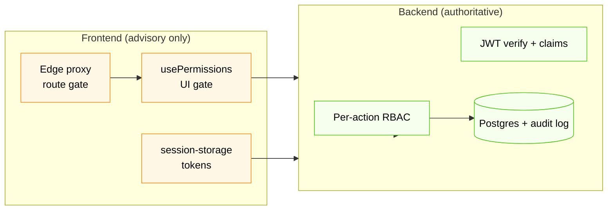

# Security

The frontend's security posture, the threat model it's designed against, and the hardening backlog. The hard authority on every privileged action is the backend — the FE's job is to fail safely, not to act as a primary authorization boundary.

For runtime auth & RBAC mechanics, see [auth-and-rbac.md](./auth-and-rbac.md).

---

## 1. Threat model

The application targets:

| Threat | Mitigation in place |
|---|---|
| **Cross-site scripting (XSS)** | React escapes all rendered values by default. We never use `dangerouslySetInnerHTML`. CSP forbids the page being framed (`frame-ancestors 'none'`). No third-party scripts beyond what `next/script` includes. |
| **Clickjacking** | `X-Frame-Options: DENY` + `Content-Security-Policy: frame-ancestors 'none'` (set in both [`next.config.ts`](../next.config.ts) and [`src/proxy.ts`](../src/proxy.ts)). |
| **MIME sniffing** | `X-Content-Type-Options: nosniff`. |
| **Mixed content / downgrade attacks** | `Strict-Transport-Security: max-age=63072000; includeSubDomains; preload`. |
| **Referrer leakage** | `Referrer-Policy: strict-origin-when-cross-origin`. |
| **Powerful-API abuse** | `Permissions-Policy` denies camera, mic, geolocation, payment, usb, FLoC. |
| **Wrong-scope navigation** | Edge proxy classifies routes; admin paths rewrite to not-found for org users (no path leak). |
| **Token theft via XSS** | The app does not currently put tokens in `HttpOnly` cookies — see §3 for the hardening item. |
| **CSRF on state-changing API calls** | API uses `Authorization: Bearer <jwt>` headers, not cookies, so the classical CSRF vector doesn't apply. |
| **Brute-force login / 2FA bypass** | Enforced by the backend (rate limits, lockouts, TOTP). FE simply renders the response. |
| **Inactivity → account hijack** | 10-minute idle timer auto-logs the user out (see [auth-and-rbac.md §3.2](./auth-and-rbac.md#32-inactivity-timeout)). |

Out of scope for the FE: account takeover via password reset, DDoS, key compromise on the backend, infra hardening. Those belong to the backend / ops team.

---

## 2. Where authority lives

A 403 from the backend is the ground truth. The FE may *also* hide the same action because `usePermissions().can(...)` returns false, but that's UX — it must never be relied upon as a security boundary.

---

## 3. Token storage (and the open hardening item)

### Today

After login, [`session-storage.ts`](../src/lib/session-storage.ts) saves a single payload to **two** places:

| Location | Why | Lifetime |
|---|---|---|
| `localStorage["session_data"]` | Read by the React app on every render | Until logout / clear |
| `document.cookie["session"]` | Read by the edge proxy on every navigation | `max-age=86400`, `SameSite=Strict`, `path=/` |

Both copies hold the **same** JSON payload (access token, refresh token, user, userType), AES-encrypted with `NEXT_PUBLIC_SESSION_SECRET` via `crypto-js`.

### Why the encryption is "mostly theatre"

The secret is shipped to the browser as a `NEXT_PUBLIC_*` env var. An attacker with a foothold (XSS, malicious browser extension, devtools access on a shared device) can read the secret and decrypt the cookie. The encryption helps **only** against passive, unsophisticated inspection (e.g. casual URL/cookie sharing).

The reason this layout exists at all is that the proxy (which runs at the edge) needs to read the `userType` claim **before any React code runs** in order to classify the route. A pure-`HttpOnly` cookie was incompatible with the original `localStorage`-first auth flow.

### Hardening recommendation (tracked)

Move tokens to an `HttpOnly`, `Secure`, `__Host-` prefixed cookie set by a Next Route Handler that proxies `/auth/login` and `/auth/refresh`. The browser never sees the access token; only same-origin requests can attach it; XSS no longer exfiltrates it.

This is documented in code at [`src/proxy.ts:21-24`](../src/proxy.ts) and is the single largest security item on the FE backlog. It's tracked in [known-issues.md](./known-issues.md) and is **strongly recommended** before going live with real customer data.

Once that change lands, `NEXT_PUBLIC_SESSION_SECRET` can be removed entirely.

---

## 4. Security headers (defense in depth)

Two layers ensure every response carries the same headers — if the proxy matcher ever lets a path through unprocessed, the framework-level headers in `next.config.ts` still apply.

| Header | Value | Set by |
|---|---|---|
| `Strict-Transport-Security` | `max-age=63072000; includeSubDomains; preload` | next.config + proxy |
| `X-Frame-Options` | `DENY` | next.config + proxy |
| `Content-Security-Policy` | `frame-ancestors 'none'` | next.config |
| `X-Content-Type-Options` | `nosniff` | next.config + proxy |
| `Referrer-Policy` | `strict-origin-when-cross-origin` | next.config + proxy |
| `Permissions-Policy` | `camera=(), microphone=(), geolocation=(), payment=(), usb=(), interest-cohort=()` | next.config + proxy |
| `X-DNS-Prefetch-Control` | `off` | next.config |

A full nonce-based CSP (`script-src 'self' 'nonce-...'`) is **not** yet in place. Adding `'unsafe-inline'` / `'unsafe-eval'` to make Next.js work as-is would negate most of CSP's value, so we ship the other high-value headers first and leave a proper CSP as a follow-up. See `next.config.ts` for the comment explaining this trade-off.

---

## 5. Secrets & environment variables

| Variable | Sensitivity | Notes |
|---|---|---|
| `NEXT_PUBLIC_API_URL` | Public | Reaches the browser. |
| `NEXT_PUBLIC_SESSION_SECRET` | Public, but rotate per env | Reaches the browser. Treat rotation as part of every credential incident response. Generate with `openssl rand -hex 64`. |

There are **no server-only secrets** in the frontend today — every variable is `NEXT_PUBLIC_*`. The backend is the keeper of all real secrets (DB credentials, ML model keys, signing keys for JWTs).

When the `HttpOnly` cookie hardening (§3) lands, expect to introduce server-only env vars (e.g. cookie-signing key) and drop `NEXT_PUBLIC_SESSION_SECRET`.

---

## 6. Logging & telemetry

- **Request/response logging** is on only when `NODE_ENV === "development"` (see [`src/lib/api-client.ts`](../src/lib/api-client.ts)). Production builds do not log requests or response bodies.
- **No analytics or third-party trackers** are wired in. If observability is added later, it must be reviewed against PII risks (loan amounts, applicant names, scoring decisions) before shipping.
- The backend produces all audit / compliance logs.

---

## 7. Dependency posture

- All runtime dependencies are pinned in `package.json` (`^` allows patch + minor — keep tightening before releases).
- Run `npm audit --omit=dev` before each release. There are no known high/critical advisories at the time of writing.
- `crypto-js` is used today; once we remove client-side encryption (§3), this dependency goes away too.
- The vendor list is intentionally short: shadcn/ui (vendored, not a runtime dep), Radix primitives, TanStack Query, axios, react-hook-form, zod, sonner, lucide, qrcode.react, next-themes, date-fns. No tracking SDKs, ads, or experimentation libraries.

---

## 8. Reporting issues

Security issues should not be reported via GitHub Issues. Contact the platform-security lead at PaySwitch directly. A formal disclosure policy will accompany the deployment guide.

---

## 9. Related docs

- [auth-and-rbac.md](./auth-and-rbac.md) — runtime authentication, refresh, RBAC.
- [data-flow.md](./data-flow.md) — how data flows between FE and BE.
- [known-issues.md](./known-issues.md) — tracked follow-ups including the `HttpOnly` cookie migration.
